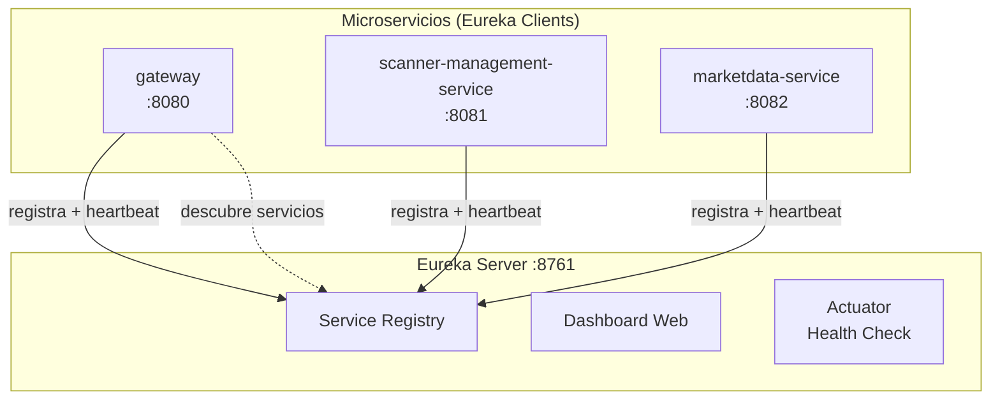

# Directory (Eureka Server)

Servidor de descubrimiento de servicios para la plataforma **MeTradingPlat**. Basado en Netflix Eureka, permite que los microservicios se registren y descubran entre si sin necesidad de configurar URLs fijas.

## Tabla de Contenido

- [Arquitectura](#arquitectura)
- [Tecnologias](#tecnologias)
- [Como Funciona](#como-funciona)
- [Servicios Registrados](#servicios-registrados)
- [Configuracion](#configuracion)
- [Ejecucion](#ejecucion)

## Arquitectura



## Tecnologias

| Tecnologia | Version | Proposito |
|---|---|---|
| Java | 21 | Runtime (Virtual Threads) |
| Spring Boot | 3.5.9 | Framework |
| Spring Cloud Netflix Eureka Server | 2025.0.0 | Service Registry |
| Docker | Multi-stage | Contenedorizacion |

## Como Funciona

1. **Registro**: Cada microservicio al iniciar se registra en Eureka con su nombre y direccion IP/puerto
2. **Heartbeat**: Los servicios envian un heartbeat periodico para confirmar que siguen activos
3. **Descubrimiento**: El Gateway consulta a Eureka para resolver `lb://service-name` a una IP:puerto real
4. **Balanceo**: Si hay multiples instancias de un servicio, el Gateway distribuye las peticiones

### Dashboard

Eureka provee un dashboard web en `http://localhost:8761` donde se pueden ver todos los servicios registrados y su estado.

## Servicios Registrados

| Servicio | Puerto | Descripcion |
|---|---|---|
| `gateway` | 8080 | API Gateway |
| `scanner-management-service` | 8081 | Gestion de escaneres |
| `marketdata-service` | 8082 | Datos de mercado |

## Configuracion

```properties
spring.application.name=directory
server.port=8761

# No se registra ni busca a si mismo (es el servidor)
eureka.client.register-with-eureka=false
eureka.client.fetch-registry=false

eureka.instance.hostname=directory
eureka.instance.prefer-ip-address=true

spring.threads.virtual.enabled=true
```

No requiere variables de entorno adicionales. El hostname `directory` es el nombre del contenedor en Docker Compose.

### Actuator

Endpoints expuestos: `/actuator/health`, `/actuator/info`

## Ejecucion

### Con Docker Compose

```bash
# Desde la raiz de metradingplat/
docker compose up -d directory
```

Dashboard disponible en `http://localhost:8761`.

### Desarrollo Local

```bash
cd directory

# Requiere Java 21 y Maven
mvn spring-boot:run
```
